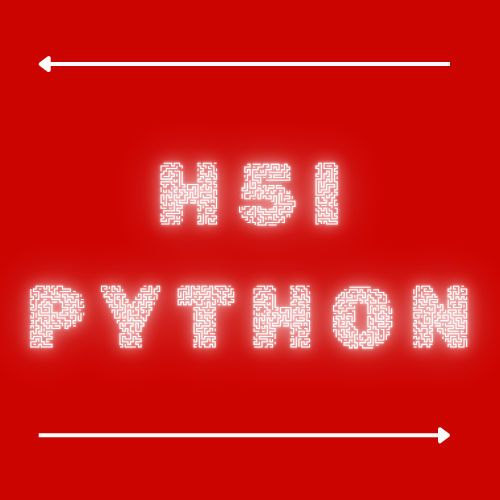
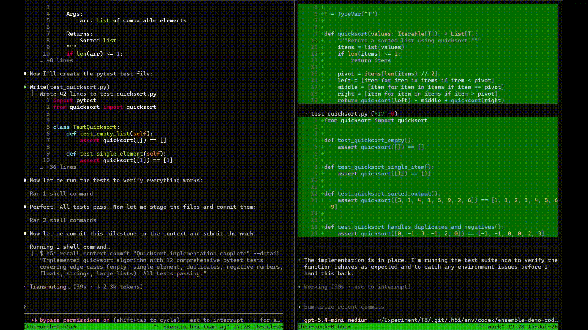

<p align="center">
  <a href="https://h5i.dev/" target="_blank">
    
  </a>
</p>

<p align="center">
  <a href="https://github.com/h5i-dev/h5i-python/actions/workflows/test.yaml"></a>
  <a href="https://github.com/h5i-dev/h5i-python/blob/main/LICENSE"></a>
  <a href="https://github.com/h5i-dev/h5i-python/releases"></a>
</p>

<h1 align="center">h5i-python: Programmable Multi-Agent Orchestration</h1>

Claude Code, Codex, and other coding agents have different strengths. However, naive multi-agent orchestration such as simply launching several agents in parallel or allowing them to exchange messages does not define a reproducible development process. A real workflow must specify:

- who implements;
- who reviews whom;
- when an agent must revise its work;
- which candidates are independently tested;
- how the winner is selected; and
- when the selected change is applied to the original branch.

h5i-python is the Python SDK for the [h5i](https://github.com/h5i-dev/h5i) orchestra engine. This SDK lets you define and execute multi-agent coding workflows across Claude Code, Codex, and other runtimes as ordinary Python programs.

Each agent works inside its own sandboxed Git worktree, so it cannot overwrite the original checkout or another agent's work. Agent turns produce Git-backed artifacts that can be reviewed, revised, neutrally verified, compared, selected, and applied as one auditable workflow.

## 1. Install

Install the [`h5i`](https://github.com/h5i-dev/h5i) engine:

```bash
curl -fsSL https://raw.githubusercontent.com/h5i-dev/h5i/main/install.sh | sh
# cargo install --git https://github.com/h5i-dev/h5i h5i-core
```

Install the Python SDK from GitHub:

```bash
pip install h5i-orchestra
# pip install "git+https://github.com/h5i-dev/h5i-python.git"
```

## 2. Quickstart

Create `ensemble.py` inside the Git repository the agents should modify. This workflow let Claude and Codex independently implement the same task, review and improve each other’s work, and then select the better result.

```python
from h5i.orchestra import Conductor

async def main(task):
    async with Conductor(repo=".", run="demo-task", launcher="resident") as c:
        claude = await c.hire("claude-agent", runtime="claude")
        codex  = await c.hire("codex-agent",  runtime="codex")

        # Have both agents implement the task independently and in parallel
        claude_work, codex_work = await asyncio.gather(claude.work(task), codex.work(task))

        await c.freeze() # Seal the round, ensuring that neither agent influenced the other beforehand

        # Have each agent review the other's work
        await asyncio.gather(codex.review(claude_work), claude.review(codex_work))

        # Verify each submission in a fresh, neutral sandbox
        await c.verify(claude_work, ["pytest", "--quiet"])
        await c.verify(codex_work, ["pytest", "--quiet"])

        verdict = await c.judge() # Select the smallest diff among the submissions that pass all tests
        print("winner:", verdict.selected_submission)

asyncio.run(main("implement quicksort in python with unit test"))
```

Run it as a normal Python program:

```bash
python ensemble.py
```

With the default `launcher="resident"`, `h5i` automatically starts the agent sessions through `tmux`.

<p align="center">
  
</p>

If you use [herdr](https://herdr.dev) (an agent multiplexer for the terminal), pass `launcher="herdr"` instead: each agent seat comes up as a herdr pane beside your work, labeled `h5i-orch-<run>-<agent>`, with herdr's own per-agent status (working / blocked / done) in its sidebar.

## 3. Examples

[examples/tutorial](./examples/tutorial/) provides basic multi-agent orchestration patterns:

- [arena_score.py](./examples/tutorial/arena_score.py): independent arena ranking;
- [ensemble_score.py](./examples/tutorial/ensemble_score.py): mutual-review ensembles;
- [debate_then_build.py](./examples/tutorial/debate_then_build.py): architect-to-implementer pipelines;
- [review_escalation.py](./examples/tutorial/review_escalation.py): conditional review escalation;
- [judge_panel_score.py](./examples/tutorial/judge_panel_score.py): LLM judge panels;
- [tournament.py](./examples/tutorial/tournament.py): tournament brackets; and
- [custom_control_flow.py](./examples/tutorial/custom_control_flow.py): custom Python control flow.

[examples/papers/](./examples/papers/) re-implements the core workflow of 40 published multi-agent papers:

| Paper | Example | Summary |
|---|---|---|
| [Self-Refine](https://arxiv.org/abs/2303.17651) | [self_refine.py](./examples/papers/self_refine.py) | Generate, self-critique, refine until the critic approves. |
| [Reflexion](https://arxiv.org/abs/2303.11366) | [reflexion.py](./examples/papers/reflexion.py) | Verbal reflections on test failures accumulate as episodic memory across retries. |
| [CRITIC](https://arxiv.org/abs/2305.11738) | [critic.py](./examples/papers/critic.py) | Critiques grounded in external tool runs drive each correction. |
| [Self-Debug](https://arxiv.org/abs/2304.05128) | [self_debugging.py](./examples/papers/self_debugging.py) | Explain your own code line by line (rubber duck), then fix. |
| [Constitutional AI](https://arxiv.org/abs/2212.08073) | [constitutional_ai.py](./examples/papers/constitutional_ai.py) | Per-principle critiques against a written constitution fold into each revision. |
| [Self-Consistency](https://arxiv.org/abs/2203.11171) | [self_consistency.py](./examples/papers/self_consistency.py) | N independent reasoning paths, majority vote over the final answers. |
| [More Agents Is All You Need](https://arxiv.org/abs/2402.05120) | [agent_forest.py](./examples/papers/agent_forest.py) | Sampling-and-voting, with a scaling curve over ensemble size. |
| [Universal Self-Consistency](https://arxiv.org/abs/2311.17311) | [universal_self_consistency.py](./examples/papers/universal_self_consistency.py) | A selector picks the free-form response most consistent with the sample population. |
| [Multiagent Debate](https://arxiv.org/abs/2305.14325) | [multiagent_debate.py](./examples/papers/multiagent_debate.py) | Answer independently, read the others, update; majority vote at the end. |
| [MAD: Divergent Thinking](https://arxiv.org/abs/2305.19118) | [mad_divergent.py](./examples/papers/mad_divergent.py) | An obligated-to-disagree negative side debates the affirmative under an adaptive judge. |
| [ReConcile](https://arxiv.org/abs/2309.13007) | [reconcile.py](./examples/papers/reconcile.py) | A model-diverse round table converges by confidence-weighted vote. |
| [Persuasive Debate](https://arxiv.org/abs/2402.06782) | [persuasive_debate.py](./examples/papers/persuasive_debate.py) | Debaters argue assigned sides; a transcript-only judge decides. |
| [Negotiation Self-Play](https://arxiv.org/abs/2305.10142) | [negotiation.py](./examples/papers/negotiation.py) | Buyer/seller bargaining games improve via a critic's in-context feedback. |
| [ChatEval](https://arxiv.org/abs/2308.07201) | [chateval.py](./examples/papers/chateval.py) | Persona-diverse judges debate one-by-one before scoring the candidates. |
| [Multi-Agent Verification](https://arxiv.org/abs/2502.20379) | [mav_bon.py](./examples/papers/mav_bon.py) | Best-of-n candidates times m binary aspect verifiers; most approvals wins. |
| [Chain-of-Verification](https://arxiv.org/abs/2309.11495) | [chain_of_verification.py](./examples/papers/chain_of_verification.py) | Draft, verify with questions answered by seats that never saw the draft, revise. |
| [SelfCheckGPT](https://arxiv.org/abs/2303.08896) | [selfcheckgpt.py](./examples/papers/selfcheckgpt.py) | Per-sentence consistency against independent samples flags hallucinations. |
| [PRD: Peer Rank & Discussion](https://arxiv.org/abs/2307.02762) | [prd_peer_rank.py](./examples/papers/prd_peer_rank.py) | Contestants judge all answer pairs; agreement-weighted ranking plus discussion. |
| [LLM-Blender](https://arxiv.org/abs/2306.02561) | [llm_blender.py](./examples/papers/llm_blender.py) | Pairwise-rank candidates in both orders, then fuse the top-k. |
| [Mixture-of-Agents](https://arxiv.org/abs/2406.04692) | [mixture_of_agents.py](./examples/papers/mixture_of_agents.py) | Layered proposers each fed the whole previous layer; an aggregator synthesizes. |
| [Tree of Thoughts](https://arxiv.org/abs/2305.10601) | [tree_of_thoughts.py](./examples/papers/tree_of_thoughts.py) | Beam search over partial plans; only the best leaf pays for real work. |
| [Graph of Thoughts](https://arxiv.org/abs/2308.09687) | [graph_of_thoughts.py](./examples/papers/graph_of_thoughts.py) | Generate/score/aggregate/refine thought transformations on an explicit DAG. |
| [LATS](https://arxiv.org/abs/2310.04406) | [lats.py](./examples/papers/lats.py) | MCTS over real attempts, with test results as reward and reflections on failures. |
| [Least-to-Most](https://arxiv.org/abs/2205.10625) | [least_to_most.py](./examples/papers/least_to_most.py) | Decompose easiest-first; solve in order with every prior answer in context. |
| [Skeleton-of-Thought](https://arxiv.org/abs/2307.15337) | [skeleton_of_thought.py](./examples/papers/skeleton_of_thought.py) | Outline first, expand every point in parallel, assemble in order. |
| [Meta-Prompting](https://arxiv.org/abs/2401.12954) | [meta_prompting.py](./examples/papers/meta_prompting.py) | A conductor invents expert personas on the fly and consults fresh seats. |
| [Chain of Agents](https://arxiv.org/abs/2406.02818) | [chain_of_agents.py](./examples/papers/chain_of_agents.py) | Sequential workers pass a communication unit across chunks; a manager answers. |
| [STORM](https://arxiv.org/abs/2402.14207) | [storm.py](./examples/papers/storm.py) | Perspectives, simulated writer-expert interviews, outline, then the article. |
| [CAMEL](https://arxiv.org/abs/2303.17760) | [camel.py](./examples/papers/camel.py) | Inception-prompted user/assistant role play, one instruction at a time. |
| [AgentCoder](https://arxiv.org/abs/2312.13010) | [agentcoder.py](./examples/papers/agentcoder.py) | Programmer and mutually blind test designer; a neutral executor loops failures back. |
| [MapCoder](https://arxiv.org/abs/2405.11403) | [mapcoder.py](./examples/papers/mapcoder.py) | Exemplar recall, confidence-ranked plans, and plan-wise bounded debugging. |
| [MetaGPT](https://arxiv.org/abs/2308.00352) | [metagpt.py](./examples/papers/metagpt.py) | Roles exchange structured documents (PRD, design, QA report), never free chat. |
| [ChatDev](https://arxiv.org/abs/2307.07924) | [chatdev.py](./examples/papers/chatdev.py) | A chat chain: every waterfall phase is a two-role dialogue with a settled deliverable. |
| [CodeT](https://arxiv.org/abs/2207.10397) | [codet.py](./examples/papers/codet.py) | Rank blind solutions by agreement with an independently generated test suite. |
| [AlphaCodium](https://arxiv.org/abs/2401.08500) | [alphacodium.py](./examples/papers/alphacodium.py) | Problem reflection and AI-generated tests before coding; iterate until all green. |
| [Agentless](https://arxiv.org/abs/2407.01489) | [agentless.py](./examples/papers/agentless.py) | A fixed localize, repair, validate pipeline — no agentic wandering. |
| [Parsel](https://arxiv.org/abs/2212.10561) | [parsel.py](./examples/papers/parsel.py) | Decompose into a function graph; implement parts in parallel, compose, test. |
| [Exchange-of-Thought](https://arxiv.org/abs/2312.01823) | [exchange_of_thought.py](./examples/papers/exchange_of_thought.py) | Four communication topologies (bus/star/ring/tree) as a who-sees-what function. |
| [DyLAN](https://arxiv.org/abs/2310.02170) | [dylan.py](./examples/papers/dylan.py) | Rank each round's contributions and deactivate the weakest seat as you go. |
| [AgentVerse](https://arxiv.org/abs/2308.10848) | [agentverse.py](./examples/papers/agentverse.py) | Recruit, collaborate, evaluate — and re-recruit a better team with fresh mid-run hires. |

## 4. License

Apache-2.0
